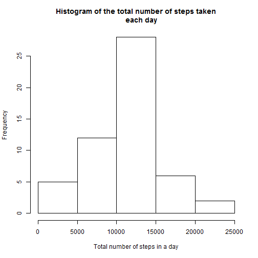
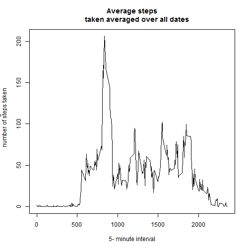
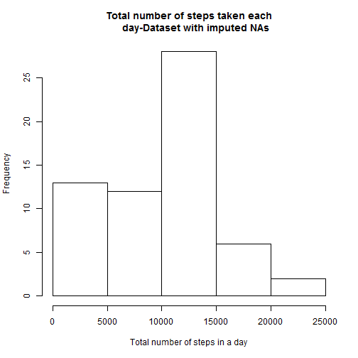
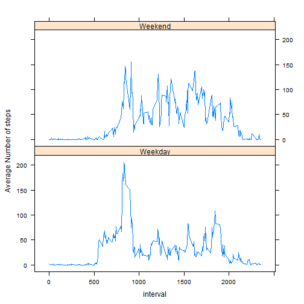

Loading and Preprocessing the data
===========================================================================

```r
# Load all the packages used in this project

library(dplyr)
library(knitr)
library(lattice)
```


```r
# read data from "activity.csv" file
activitydata <- read.csv("activity.csv",na.strings = "NA")

# view the first 10 rows of the read data

head(activitydata,10)
```

```
##    steps       date interval
## 1     NA 2012-10-01        0
## 2     NA 2012-10-01        5
## 3     NA 2012-10-01       10
## 4     NA 2012-10-01       15
## 5     NA 2012-10-01       20
## 6     NA 2012-10-01       25
## 7     NA 2012-10-01       30
## 8     NA 2012-10-01       35
## 9     NA 2012-10-01       40
## 10    NA 2012-10-01       45
```

```r
# convert the date column of activitydate into date class

activitydata$date<-as.Date(activitydata$date)
```

# What is mean total number of steps taken per day?
**1.Calculate the total number of steps taken per day**

```r
# use group_by function of dplyr package to group the number of steps date wise
datewise<-group_by(activitydata,date) 

# creates a pivot of dates with sum of total steps
totalsteps<-summarize(datewise,totalsteps=sum(steps))

# view top 20 rows of totalsteps dataframe
head(totalsteps,20)
```

```
## Source: local data frame [20 x 2]
## 
##          date totalsteps
##        (date)      (int)
## 1  2012-10-01         NA
## 2  2012-10-02        126
## 3  2012-10-03      11352
## 4  2012-10-04      12116
## 5  2012-10-05      13294
## 6  2012-10-06      15420
## 7  2012-10-07      11015
## 8  2012-10-08         NA
## 9  2012-10-09      12811
## 10 2012-10-10       9900
## 11 2012-10-11      10304
## 12 2012-10-12      17382
## 13 2012-10-13      12426
## 14 2012-10-14      15098
## 15 2012-10-15      10139
## 16 2012-10-16      15084
## 17 2012-10-17      13452
## 18 2012-10-18      10056
## 19 2012-10-19      11829
## 20 2012-10-20      10395
```

```r
# remove entries with "NA" from totalsteps

removeNA<-complete.cases(totalsteps)
totalsteps<-totalsteps[removeNA,]

#view top 20 rows of totalsteps without NAs
head(totalsteps,20)
```

```
## Source: local data frame [20 x 2]
## 
##          date totalsteps
##        (date)      (int)
## 1  2012-10-02        126
## 2  2012-10-03      11352
## 3  2012-10-04      12116
## 4  2012-10-05      13294
## 5  2012-10-06      15420
## 6  2012-10-07      11015
## 7  2012-10-09      12811
## 8  2012-10-10       9900
## 9  2012-10-11      10304
## 10 2012-10-12      17382
## 11 2012-10-13      12426
## 12 2012-10-14      15098
## 13 2012-10-15      10139
## 14 2012-10-16      15084
## 15 2012-10-17      13452
## 16 2012-10-18      10056
## 17 2012-10-19      11829
## 18 2012-10-20      10395
## 19 2012-10-21       8821
## 20 2012-10-22      13460
```

**2. Make a histogram of the total number of steps taken each day**

```r
hist(totalsteps$totalsteps, main="Histogram of the total number of steps taken
     each day", xlab="Total number of steps in a day")
```

 


**3. Calculate and report the mean and median of the total number of steps taken per day**


```r
mean_totalsteps<-mean(totalsteps$totalsteps)
median_totalsteps<-median(totalsteps$totalsteps)

print(paste("Mean and Median of total number of steps taken per day are", mean_totalsteps,"and", median_totalsteps,"respectively."))
```

```
## [1] "Mean and Median of total number of steps taken per day are 10766.1886792453 and 10765 respectively."
```


What is the average daily activity pattern?
=============================================================

**1. Make a time series plot (i.e. type = "l") of the 5-minute interval (x-axis) and the average number of steps taken, averaged across all days (y-axis)**


```r
# group the activitydata by intervals

intervalwise<-group_by(activitydata,interval)
#show first 10 rows of the grouped data
head(intervalwise,10)
```

```
## Source: local data frame [10 x 3]
## Groups: interval [10]
## 
##    steps       date interval
##    (int)     (date)    (int)
## 1     NA 2012-10-01        0
## 2     NA 2012-10-01        5
## 3     NA 2012-10-01       10
## 4     NA 2012-10-01       15
## 5     NA 2012-10-01       20
## 6     NA 2012-10-01       25
## 7     NA 2012-10-01       30
## 8     NA 2012-10-01       35
## 9     NA 2012-10-01       40
## 10    NA 2012-10-01       45
```

```r
# remove the rows with NA
removeNA1<-complete.cases(intervalwise)
intervalwise_noNA <-intervalwise[removeNA1,]

# show first 10 rows of intervalwise dataframe with NAs removed
head(intervalwise_noNA,10)
```

```
## Source: local data frame [10 x 3]
## Groups: interval [10]
## 
##    steps       date interval
##    (int)     (date)    (int)
## 1      0 2012-10-02        0
## 2      0 2012-10-02        5
## 3      0 2012-10-02       10
## 4      0 2012-10-02       15
## 5      0 2012-10-02       20
## 6      0 2012-10-02       25
## 7      0 2012-10-02       30
## 8      0 2012-10-02       35
## 9      0 2012-10-02       40
## 10     0 2012-10-02       45
```

```r
# create a pivot for interval and corresponding average steps for all the days
avgsteps<-summarize(intervalwise_noNA,averagesteps=mean(steps))

# show top 20 rows of the final dataset
head(avgsteps,20)
```

```
## Source: local data frame [20 x 2]
## 
##    interval averagesteps
##       (int)        (dbl)
## 1         0    1.7169811
## 2         5    0.3396226
## 3        10    0.1320755
## 4        15    0.1509434
## 5        20    0.0754717
## 6        25    2.0943396
## 7        30    0.5283019
## 8        35    0.8679245
## 9        40    0.0000000
## 10       45    1.4716981
## 11       50    0.3018868
## 12       55    0.1320755
## 13      100    0.3207547
## 14      105    0.6792453
## 15      110    0.1509434
## 16      115    0.3396226
## 17      120    0.0000000
## 18      125    1.1132075
## 19      130    1.8301887
## 20      135    0.1698113
```

```r
# plot the required time series graph

plot(avgsteps$interval,avgsteps$averagesteps, type="l", main ="Average steps
     taken averaged over all dates", xlab="5- minute interval", ylab ="average
     number of steps taken")
```

 

**2. Which 5-minute interval, on average across all the days in the dataset, contains the maximum number of steps?**


```r
maxsteps<-arrange(avgsteps,desc(averagesteps))
head(maxsteps)
```

```
## Source: local data frame [6 x 2]
## 
##   interval averagesteps
##      (int)        (dbl)
## 1      835     206.1698
## 2      840     195.9245
## 3      850     183.3962
## 4      845     179.5660
## 5      830     177.3019
## 6      820     171.1509
```

```r
print("The '5-second' interval 835 has the maximum average value of steps(206.1698)")
```

```
## [1] "The '5-second' interval 835 has the maximum average value of steps(206.1698)"
```

Imputing missing values
================================
**1. Calculate and report the total number of missing values in the dataset**


```r
countNA<-sum(is.na(activitydata))
print(paste("There are", countNA, "missing values in the original data"))
```

```
## [1] "There are 2304 missing values in the original data"
```

**2. Devise a strategy for filling in all of the missing values in the dataset. The strategy does not need to be sophisticated. For example, you could use the mean/median for that day, or the mean for that 5-minute interval, etc.**

*I have devised a strategy to replace the missing values (NAs) in the original data by median of the steps of a 5-minute interval. Median has been chosen because it gives a better estimate/idea of a particular distribution. A single "off value" ( i.e a very high or very low value) can significantly change the mean of a distribution.*
 

**3. Create a new dataset that is equal to the original dataset but with the missing data filled in.**


```r
new_activitydata <- activitydata
mediansteps <- summarize(intervalwise_noNA,steps_median=median(steps))
for (i in 1:nrow(new_activitydata))
{
        if(is.na(new_activitydata$steps[i]))
        {
                interval_val<-new_activitydata$interval[i]
                steps_val<-mediansteps[mediansteps$interval==interval_val,]
                new_activitydata$steps[i] <- steps_val$steps_median
        }
}

head(new_activitydata,10)
```

```
##    steps       date interval
## 1      0 2012-10-01        0
## 2      0 2012-10-01        5
## 3      0 2012-10-01       10
## 4      0 2012-10-01       15
## 5      0 2012-10-01       20
## 6      0 2012-10-01       25
## 7      0 2012-10-01       30
## 8      0 2012-10-01       35
## 9      0 2012-10-01       40
## 10     0 2012-10-01       45
```


**4(a). Make a histogram of the total number of steps taken each day and Calculate and report the mean and median total number of steps taken per day.**


```r
# convert the date column of activitydate into date class

new_activitydata$date<-as.Date(new_activitydata$date)


# use group_by function of dplyr package to group the number of steps date wise
datewise_new<-group_by(new_activitydata,date) 

# creates a pivot of dates with sum of total steps
totalsteps_new<-summarize(datewise_new,totalsteps_new=sum(steps))


# Make a histogram of the total number of steps taken each day

hist(totalsteps_new$totalsteps_new, main= "Total number of steps taken each
     day-Dataset with imputed NAs", xlab="Total number of steps in a day")
```

 

**4(b). Calculate and report the mean and median total number of steps taken per day**

```r
mean_totalsteps_new<-mean(totalsteps_new$totalsteps_new)
median_totalsteps_new<-median(totalsteps_new$totalsteps_new)

print(paste("Mean and Median of total number of steps taken per day of the new dataset with imputed NAs are", mean_totalsteps_new,"and", median_totalsteps_new,"respectively."))
```

```
## [1] "Mean and Median of total number of steps taken per day of the new dataset with imputed NAs are 9503.86885245902 and 10395 respectively."
```

**4(c). Do these values differ from the estimates from the first part of the assignment? What is the impact of imputing missing data on the estimates of the total daily number of steps?**

**Answer:** *Yes, if we impute the NA values in the orignial dataset with median of* *"5-minute" interval, there is a significant change in the mean and median of total number* *of steps taken per day. New mean and medians are less than the old ones. This reduction is* *attributed to the replacement of NA with "medians". Since median of a distribution is* *always less than or equal to its mean, in our case, new mean and median have decreased.*
*After imputting the missing data by median of 5-min intervals, frequency of 0-5000 steps has increased from around 10 to 13.5.*


Are there differences in activity patterns between weekdays and weekends?
============================================================================

**1. Create a new factor variable in the dataset with two levels – “weekday” and “weekend” indicating whether a given date is a weekday or weekend day.**


```r
newdata<-mutate(new_activitydata, day=weekdays(new_activitydata$date))
for( i in 1:nrow(newdata))
{
        if(newdata$day[i]== "Sunday")
        {
                newdata$daytype[i]<-"Weekend"
        }
        else if (newdata$day[i]=="Saturday")
        {
                newdata$daytype[i]<-"Weekend"
        }
        else
        {
                newdata$daytype[i]<-"Weekday"
        
        }
}

newdata$daytype<-as.factor(newdata$daytype)

# View top 10 rows of the new dataset
head(newdata,10)
```

```
##    steps       date interval    day daytype
## 1      0 2012-10-01        0 Monday Weekday
## 2      0 2012-10-01        5 Monday Weekday
## 3      0 2012-10-01       10 Monday Weekday
## 4      0 2012-10-01       15 Monday Weekday
## 5      0 2012-10-01       20 Monday Weekday
## 6      0 2012-10-01       25 Monday Weekday
## 7      0 2012-10-01       30 Monday Weekday
## 8      0 2012-10-01       35 Monday Weekday
## 9      0 2012-10-01       40 Monday Weekday
## 10     0 2012-10-01       45 Monday Weekday
```

**2. Make a panel plot containing a time series plot (i.e. type = "l") of the 5-minute interval (x-axis) and the average number of steps taken, averaged across all weekday days or weekend days (y-axis).**


```r
intervalwise_new<-group_by(newdata,interval,daytype)
finalset <- summarize(intervalwise_new,totalsteps=mean(steps))
xyplot(finalset$totalsteps~finalset$interval|finalset$daytype, layout=c(1,2),
       type="l", xlab="interval", ylab="Average Number of steps")
```

 
